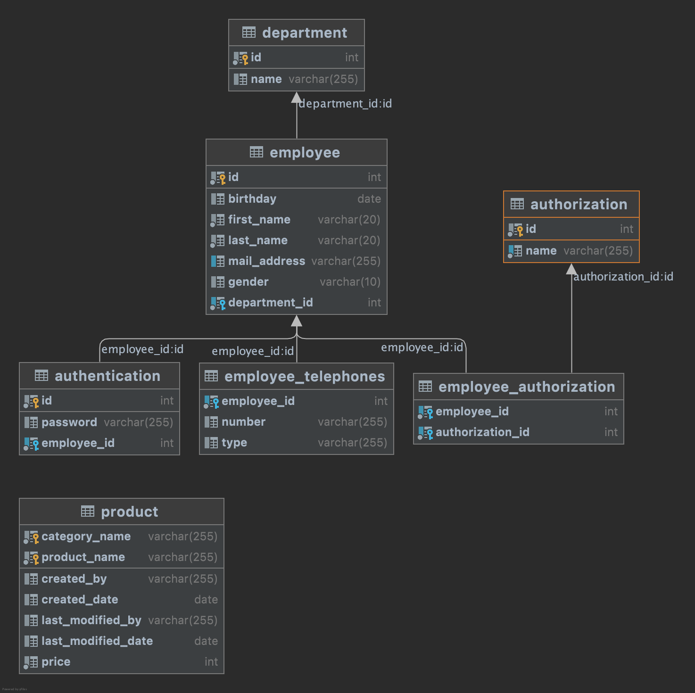

# employeeManagement

- ORM(Hibernate) および Spring Data JPA の使い方になれる
- Hibernate が Object から生成する DDL の理解を深める
- リレーションシップをもつリソースの扱いに関しての理解を深める

ための素振り。

---
## ER



---
## Run local

- jdk version

```shell
$ export JAVA_HOME=`/usr/libexec/java_home -v 11`

$ java -version
openjdk version "11.0.8" 2020-07-14
OpenJDK Runtime Environment AdoptOpenJDK (build 11.0.8+10)
OpenJDK 64-Bit Server VM AdoptOpenJDK (build 11.0.8+10, mixed mode)
```

- run MySQL container

```shell
$ docker compose up -d

$ docker compose ps   
NAME                        COMMAND                  SERVICE             STATUS              PORTS
employee-management-mysql   "docker-entrypoint.s…"   mysql               running             0.0.0.0:3306->3306/tcp
```

- run application

```shell
./mvnw spring-boot:run
```

- or build and run appliation

```shell
$ ./mvnw clean package

$ java -jar target/employeeManagement-0.0.1-SNAPSHOT.jar
```

---
## Test API

- you can use [postman collection](./postman)
